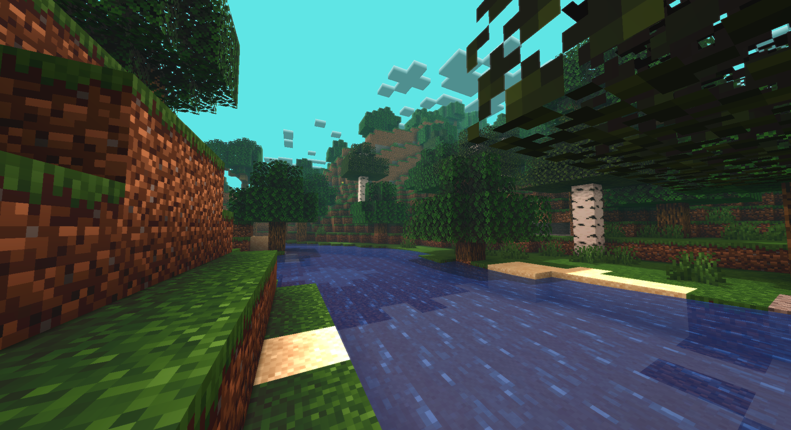
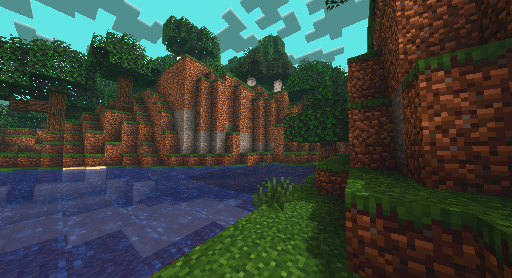
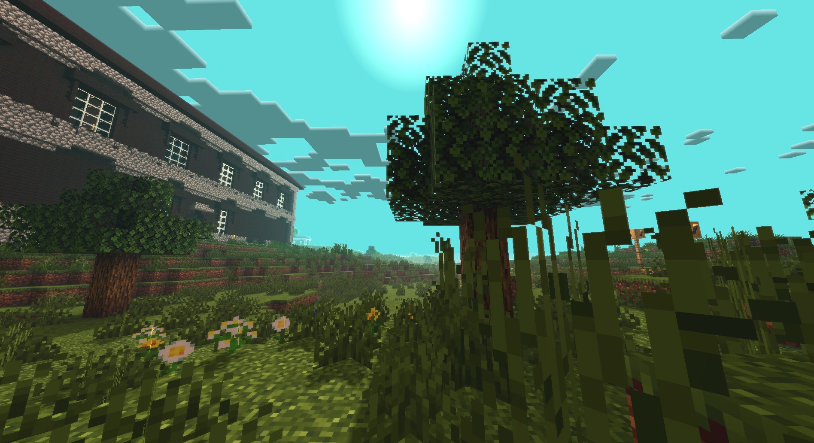

# m1neral's very believable shaders
* These shaders aren't meant for use, they're made as practice.
* Only basic use cases are accounted for, nothing will look normal if used at night, during rain or in buildings.
## Screenshots

